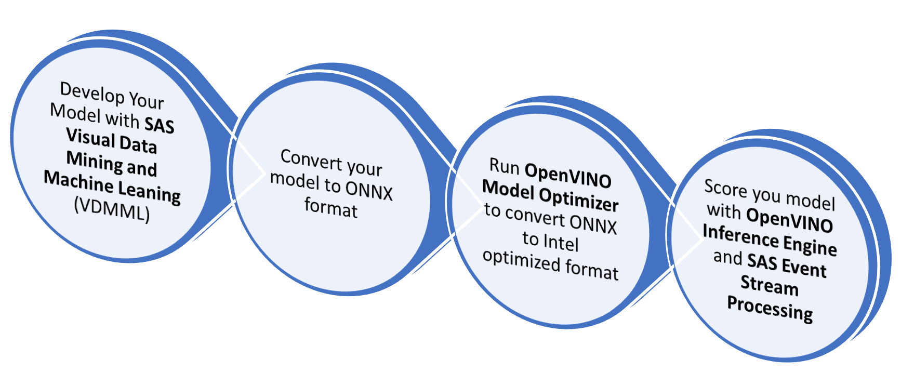
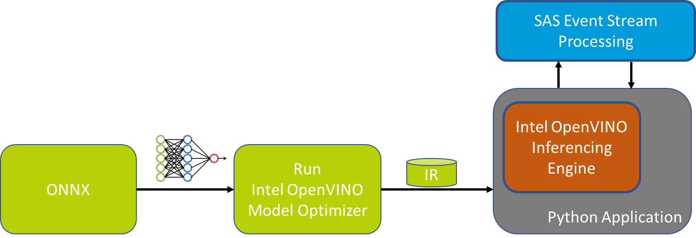

# Deploying SAS Tiny YoloV2 models on OpenVINO

    

## Overview

The purpose of this tutorial is to provide a guideline on how to convert and score SAS Tiny YoloV2 computer vision models leveraging the Intel OpenVINO framework and ONNX format.

We will also highlight some of the functional difference between ONNX format and native SAS ASTORE format that needs to betake in consideration.

OpenVINO is an inferencing (scoring) toolkit provided by Intel that aims to ensure quick deployment on Intel hardware of applications and solutions that emulate human vision by:

*  Enabling Convolutional Neural Networks (CNN) based deep learning Inference (Scoring) on the edge.
*  Supporting heterogeneous execution across Intel CPU, Intel Integrated Graphics, Intel FPGA, Intel Movidius Neural Compute Stick,  Intel Neural Compute Stick 2 and Intel Vision Accelerator Design with  Intel Movidius VPUs

Additional information on the toolkit might be found here: https://software.intel.com/en-us/openvino-toolkit

### Process Flow

The picture below describes the typical model development flow that applies to this scenario:



### Model Development and ONNX Conversion

For this tutorial, we assume that Tiny Yolo V2 models has already been developed and converted to ONNX. If you are interested additional information on how developing and converting Yolo Model those Video Tutorial will provide all required information:


*  [Object Detection With Tiny YOLOv2 Model](https://video.sas.com/detail/video/6001747750001/object-detection-with-tiny-yolov2-model)
*  [Import and Export Deep Learning Models With ONNX](https://video.sas.com/detail/video/6001743770001/import-and-export-deep-learning-models-with-onnx)

Besides, you will here find a code example for both topics:

* [Using SAS DLPy to Create A YOLOv2 Object Detection Model](https://github.com/sassoftware/python-dlpy/blob/master/examples/object_detection/SimpleObjectDetection.ipynb) 
* [Export to ONNX](https://github.com/sassoftware/python-dlpy/blob/master/examples/onnx/DLPy_Export_ONNX.ipynb)

*Note: This tutorial also assumes that you're familiar with ONNX deep learning models open format. The ONNX objective is to provide a way to easily move models between state-of-the-art tools and choose the combination that is best for them. Additional information on ONNX might be found here: https://onnx.ai/**

### OpenVINO Model Optimizer



OpenVINO Inference Engine similar to other algorithm scoring engine support only a custom optimized format named Intermediate Representation (IR). 

Model Optimizer is the OpenVINO tool that converts and optimize models from Caffe*, TensorFlow*, Kaldi*, MXNet* or ONNX* format to the Intermediate Representation (IR) of the  network, which can be read, loaded, and inferred with the Inference Engine. 

### Score your model

Once converted the model is ready to be scored by OpenVINO inferencing engine. This task, differently from standard SAS deployment, require some coding either in Python or C++ to instantiate the engine and manage the algorithm input and output. For additional information please read the chapter *Deep Dive on Model Output Decoding and Input Encoding* later in this tutorial.

SAS Event Stream Processing (ESP), might also orchestrate OpenVINO inferencing engine leveraging the python interoperability framework, this might be very useful for distributed and heterogeneous scenarios with multiple input source, needs for data conversion and complex analysis.

### Prerequisites

**Hardware:**
* 64-bit Intel Processor or ARM7 Processor (Raspberry & Neural Compute Stick 2 only)
* USB Web Camera or Embedded Laptop Camera compatible with OpenCV such as UVC cameras.
* *[Optional]* Intel Neural Compute Stick 2 (NCS2): required to run the MYRIAD configuration

**Software:**
* Microsoft Windows* 10 64-bit or Ubuntu Linux 64-bit 16.04/18.04  or Raspbian ARM32
* Python 3.6.4 or above
* OpenVINO Toolkit 2019 R2 or above


### **Installation**

1. Install Python follow the instruction at https://www.python.org/downloads/
2. Download OpenVINO from this link (registration required): https://software.intel.com/en-us/openvino-toolkit/choose-download/
3. Setup OpenVINO by following carefully the following instruction (that includes additional software dependency):
- Linux: https://docs.openvinotoolkit.org/latest/_docs_install_guides_installing_openvino_linux.html
- Windows: https://docs.openvinotoolkit.org/latest/_docs_install_guides_installing_openvino_windows.html
- Raspbian: https://docs.openvinotoolkit.org/latest/_docs_install_guides_installing_openvino_raspbian.html

  ***Please follow all the installation steps as they are a pre-requisite for this tutorial. This includes installing all external software dependency, configuring model optimizer (at least for the ONNX format) and run the verification scripts that are responsible to install additional dependencies.*** 

  *If you would like to score on Intel Processor Graphics (GPU) or Intel Neural Compute Stick 2 please also follow the relative section on the installation guide*

*  Clone or download this repository to OpenVINO machine

*Note: This tutorial assumes that **OpenVINO is installed under the standard directory** proposed by the setup tools. If you opted for a different path you would have to change the path of the environment initialization script in all *.sh or *.bat files.*


## **Getting Started**

### **Convert SAS YoloV2 Computer Vision (CV) Models**

*Note: Raspbian OpenVINO support is limited to the inference engine, this means that you would need to run the model conversion steps described in this paragraph either on a Windows or Linux PC and then copy the converted model on the device*

SAS Provide several pre-trained models for testing and development purpose at this page:

http://support.sas.com/documentation/prod-p/vdmml/zip/index.html

For this tutorial please download the following modules:

* [Object detection using Tiny YoloV2](http://support.sas.com/documentation/prod-p/vdmml/zip/tiny_yolov2_313cls.zip): 313 class object detection model and pre-trained weights
* [Face detection using Tiny YoloV2](http://support.sas.com/documentation/prod-p/vdmml/zip/tiny_yolov2_face.zip): Face detection model and pre-trained weights

Once downloaded please extract the *.ONNX files from both archive and move:

* `Tiny-Yolov2_face.onnx` under `Face` directory
* `Tiny-Yolov2.onnx` under `Objects` directory

The folder structure should then look like the following one:

```
+---Face
|       Convert_Model.bat       --> Model Conversion script for Windows
|       Convert_Model.sh        --> Model Conversion script for Linux
|       Tiny-Yolov2_face.onnx   --> ONNX Model
|       Tiny-Yolov2_face.py     --> Tiny YoloV2 metadata needed for scoring
|       
+---Objects
|       Convert_Model.bat       --> Model Conversion script for Windows
|       Convert_Model.sh        --> Model Conversion script for Linux
|       Tiny-Yolov2.onnx        --> ONNX Model
|       Tiny-Yolov2.py          --> Tiny YoloV2 metadata needed for scoring
```

To generate the openVINO compatible model simply run from `Face` and `Object` directory the following script:

- On Windows:

```batch
Convert_Model.bat 
```

- On Linux

```bash
chmod +x Convert_Model.sh
./Convert_Model.sh
```

This command will create a directory similar to the following with the converted model.

```
+---Objects
|   +---FP16
|   |       Tiny-Yolov2.bin
|   |       Tiny-Yolov2.mapping
|   |       Tiny-Yolov2.xml
```


The Convert_Modell scrip objective is to ensure that all environment variables are set and that the OpenVINO model optimizer runs with relevant parameters.  This is the file content for Windows script:

```bash
source /opt/intel/openvino/bin/setupvars.sh

#Set below Model Parameter
export ONNX_MODEL_NAME=Tiny-Yolov2.onnx
#-------

export MODEL_DIR=$(dirname $0)
export MODEL_OPT_DIR=$INTEL_CVSDK_DIR/deployment_tools
export ONNX_PATH=$MODEL_DIR/$ONNX_MODEL_NAME
export OUTPUT_DIR=$MODEL_DIR

#python3 $MODEL_OPT_DIR/model_optimizer/mo.py  --data_type FP32 --input_model $ONNX_PATH --output_dir $OUTPUT_DIR/FP32
python3 $MODEL_OPT_DIR/model_optimizer/mo.py  --data_type FP16 --input_model $ONNX_PATH --output_dir $OUTPUT_DIR/FP16
```

As you might have noticed for this tutorial we opt to use only precision FP16 since this precision is mandatory to score on Intel Neural Compute Stick 2 (NCS2) and supported from both CPU and GPU scoring. If you like to experiment precision FP32 you could uncomment the relative line in the above script. 

### **Convert Your Model**

This directory structure will easily enable you to extend this tutorial to your developed models; if you would like to do so the following action needs to be performed:

1. Copy `Objects` directory to `YourModelName`

2. Modify the following line of Convert_Model script:

   ```bash
   #Set below Model Parameters
   export ONNX_MODEL_NAME=YourModelName.onnx
   #-------
   ```

3. Rename configuration file Tiny-Yolov2.py  to YourModelName.py  (Note: configuration file and ONNX model should have the same name)

4. Modify the configuration file with your model metadata:

    ```
    yolov2_onnx_model_path=[YourModelName.onnx]
    yolov2_yoloimgsize=[size of the Yolo input image e.g 416]
    yolov2_detectionThreshold =[Ignore detected image below this score e.g. 0.4 (40%)]
    
    yolov2_boxPerCell = [Number of box detect per cell e.g. 5]
    yolov2_classes = [Number of trained classes e.g. 313]
    yolov2_anchors = [Anchor to possible object size]
    yolov2_label = ['Label1', 'Label2', '...']  
    ```

6. Run Convert_Model script.

### **Running**

#### ** Inference SAS Tiny YoloV2 Computer Vision (CV) Models**

To inference (score) our models on OpenVINO it is required to write some coding either in python or C++. No visual tools similar to SAS Event Stream Processing Studio are available as the time this tutorial has been written. We opted to develop a python script using as reference the [object_detection_demo_ssd_async.py](https://docs.openvinotoolkit.org/latest/_demos_python_demos_object_detection_demo_ssd_async_README.html) script from intel.

We leverage that script for the initialization portion of the OpenVINO Inference Engine including the asynchronous support and we implemented the YoloV2 model output decoding.

This is the python script usage from the command line:

```bash
usage: SAS_YoloV2_OpenVINO_Demo_V2.py [-h] [-m MODELDIR] [-n MODELNAME]
                                      [-p PRECISION] [-i INPUT] [-d DEVICE]

Options:
  -h, --help            Show this help message and exit.
  -m MODELDIR, --modeldir MODELDIR
                        Path model dir. Default ./Face.
  -n MODELNAME, --modelname MODELNAME
                        Name of the model .xml and .py configuration file.
                        Default Tiny-Yolov2_face.
  -p PRECISION, --precision PRECISION
                        Model Precision FP16 or FP32. Default FP16.
  -i INPUT, --input INPUT
                        Required. Path to an image/video file or camera device
                        ID. (You could specify 'cam' to work with default
                        device 0)
  -d DEVICE, --device DEVICE
                        Optional. Specify the target device to infer on; CPU,
                        GPU, FPGA, HDDL or MYRIAD are acceptable. The sample
                        will look for a suitable plugin for the device specified.
                        The default value is CPU
````

Within the folder you also found the following scripts to launch the demo *on default camera (ID 0)*:

- On Windows:

  ```bash
  Demo_YOLOV2.bat
  ```
- On Linux:

  ```bash
  chmod +x Demo_YOLOV2.sh
  ./Demo_YOLOV2.sh
  ```

By running the above scripts you will be prompt to select Model and Device:

```
SELECT MODEL:

1. Face Detection
2. Object Detection

Enter your choice: [1,2]?

SELECT DEVICE:

1. CPU
2. GPU
3. MYRIAD

Enter your choice: [1,2,3]?
```

The picture below represents the result of this tutorial with the SAS Tiny YoloV2 computer vision model inferencing on OpenVINO engine:


To close the demo you could either press ESC on the camera windows or CTRL+C on console

On the camera window, you could also press TAB to move from synchronous to the asynchronous mode and vice versa. Depending on configuration and processing power asynchronous mode might provide performance enhancement.  


#### **Scoring OpenVINO Converted Model in SAS Event Stream Processing 6.2 (ESP)**

You might also leverage the python code of this tutorial to score the SAS YoloV2 Model on SAS Event Stream Processing (ESP). This might be very useful in case you need to manage more complex scenarios like multiple cameras, heterogeneous data source management, object tracking, etc.

##### Additional Requirements:

- SAS Event Stream Processing 6.2
- 64-bit Linux Environment
- Web Camera compatible with the USB Video Class (UVC) 

##### Configurations:

- This tutorial assumes that Event Stream Processing 6.2 has been installed under `/opt/sas/SASEventStreamProcessingEngine/6.2` if you opt for a different directory please change the `DFESP_HOME` environment variable in `Start_ESP_Project.sh` and `Display_yolo.sh` scripts.
- Please review UVC camera properties under ESP project `yoloV2OpenVINO.xml` to match your camera settings and hardware settings: 
  - if your camera supports Motion-JPEG output you might change `format_in` from `YUYV` to `mjpg`
  - change `device` settings based on your camera mounting path (e.g. `/dev/video1`)
  - [Optional] you might also adapt `frame_rate` and `width/height` based on your camera capabilities and hardware capabilities. 

```xml
            <connector class="uvc" name="uvc_test">
              <properties>
                <property name="type"><![CDATA[pub]]></property>
                <!-- optional properties -->
                <!--rate of taking pictures (number / sec)-->
                <property name="frame_rate"><![CDATA[10]]></property>
                <property name="format_in"><![CDATA[YUYV]]></property>
                <property name="format_out"><![CDATA[mjpg]]></property>
                <property name="width"><![CDATA[640]]></property>
                <property name="height"><![CDATA[480]]></property>
                <property name="device"><![CDATA[/dev/video0]]></property>
              </properties>
            </connector>
```

- Configure demo parameter by update a file named `_config.py` within the `esp` directory. The aim of this file is to allow to configure all command line properties described in the inferencing settings. The default file, shown below, instruct Event Stream Processing to run the Object detection model on CPU. You could modify this setting to test different behavior.

```python
#SAS_YoloV2_OpenVINO_Demo_V2 Configuration
model_dir="../Objects"
model_name="Tiny-Yolov2.xml"
model_config_name="Tiny-Yolov2.py"
precision="FP16"
#Options CPU, GPU, MYRIAD
inf_device="CPU"

#This settings are optional if not needed leave them as None
plugin_dir = None
cpu_extension = None

#Enable multithread model (2 threads)
is_async_mode=False
```

*Note: In the `esp` directory is also available a file `_config.py.face` with the configuration needed to run face detection model on CPU. Rename this file to `_config.py` and restart ESP to use this configuration.*

##### Launch the Demo:

Open a terminal window and navigate to the root of this project. 

Start ESP with the following commands:

```bash
cd esp
chmod +x Start_ESP_Project.sh
./Start_ESP_Project.sh
```

Once Event Stream Processing is fully started open another terminal windows ad navigate the `esp` directory within this project then launch the following script to display the result of Tiny Yolo V2 model:

```bash
chmod +x Display_yolo.sh
./Display_yolo.sh
```

To terminate the demo press `CTRL+C` on both terminal windows. Yolo windows close also with the `ESC` button while on focus.

### **Deep Dive on Model Output Decoding and Input Encoding**

#### Output Decoding

As discussed above in this document the main difference from the SAS ASTORE format and the ONNX one is that ONNX requires you to explicit the decoding of Yolo Output while the ASTORE provides this feature out of the box to simplify the deployment. 

For this reason, an important portion of the effort for this demo was spent to develop a compute efficient decoding solution in python. 

The function named `decodeYoloOutput` shown below is the one responsible for this task and iterate through the algorithm output matrix. 

The shape of Object Detection model is `1x1590x13x13` (you might easily extract this information form ONNX using a tool like [Netron](https://github.com/lutzroeder/netron/releases)), this signifies that the function needs to:

1. Iterate among picture cells (13x13 matrix). 

2. For each cell iterate among the detection data that are determined by the following formulas:

   `[Number of object detectable per cell] x ([Number of Trained Classes] + [4 Object Coordinate] + [Confidence]`

   e.g. Object Detection (313 classes): 5 x (313+4+1) = 1,590 as per the shape of the output matrix

   Face Detection (1 class): 5 x (1+4+1) = 30

3. This implies that higher is the number of classes, higher will be the computational costs to decode the output layer. To reduce this impact we introduce the following conditional statement `if confidenceThresh < confidence:` that avoid iteration when we already know that detection confidence of our detected object is lower than a predefined threshold (default minimum confidence is 40%) we skip the iteration to find the most probable class for that particular detection

4. Once decoding has been completed the function calls the non_max_suppression_fast subroutine responsible to clean possible multiple detections for the same object. 

```python
def decodeYoloOutput(out, confidenceThresh=0.4):
    blockSize = 32
    numClasses = param.yolov2_classes
    _, gridHeight, gridWidth = out.shape

    boxes = np.empty((0, 4), float)
    objects_class = np.asarray([], float)
    objects_score = np.asarray([])

    for cy in range(0, gridHeight):
        for cx in range(0, gridWidth):
            for b in range(0, param.yolov2_boxPerCell):
                channel = b * (numClasses + 5)
                confidence = sigmoid(out[channel + 4][cy][cx])

                if confidenceThresh < confidence:
                    classes = np.zeros(numClasses)
                    for c in range(0, numClasses):
                        classes[c] = out[channel + 5 + c][cy][cx]
                    classes = softmax(classes)
                    detectedClass = classes.argmax()

                    if confidenceThresh < classes[detectedClass] * confidence:
                        tx = out[channel][cy][cx]
                        ty = out[channel + 1][cy][cx]
                        tw = out[channel + 2][cy][cx]
                        th = out[channel + 3][cy][cx]

                        x = (float(cx) + sigmoid(tx)) * blockSize
                        y = (float(cy) + sigmoid(ty)) * blockSize

                        w = np.exp(tw) * blockSize * param.yolov2_anchors[2 * b]
                        h = np.exp(th) * blockSize * param.yolov2_anchors[2 * b + 1]

                        box = np.asarray([(x, y, w, h)])
                        boxes = np.append(boxes, box, axis=0)
                        objects_class = np.append(objects_class, param.yolov2_label[detectedClass])
                        objects_score = np.append(objects_score,  classes[detectedClass] * confidence)

                        log.info("Detect: " + param.yolov2_label[detectedClass] + ", confidence: " + str(confidence) +
                              ", class prob: " + str(classes[detectedClass]) + ", overall prob: "
                              + str(classes[detectedClass] * confidence))

    #check if any box has been detected
    if len(boxes):
        pick = non_max_suppression_fast(boxes, overlapThresh=0.45)

        boxes = boxes [pick]
        objects_class = objects_class[pick]
        objects_score = objects_score[pick]
        # make image coordinate size independent by dividing all conten of box array for current image size declared
        boxes = boxes / param.yolov2_yoloimgsize

    return boxes, objects_class, objects_score
```


If you like to learn more on Yolo model Output decoding you could read the following articles:

- [Gentle guide on how YOLO Object Localization](https://heartbeat.fritz.ai/gentle-guide-on-how-yolo-object-localization-works-with-keras-part-2-65fe59ac12d) 
- [Real-time object detection with YOLO](http://machinethink.net/blog/object-detection-with-yolo/)

#### Input Encoding

Similar to output decoding also the Yolo input need some coding to ensure that images are sent in the right format for the model input shape (1x3x416x416):

1. The image needs to be resized to required Yolo resolution (416x416), this operation is performed by a specialized window in ESP or by the main_camera function if we are using the command line demo.
2. Then the image is provided to preprocess_input function that:
   1. Retrieve from the model the input shape
   2. Convert the image from blob buffer to OpenCV array format (Numpy) if ESP is the origin
   3. Normalize array value from 0 to 1 by dividing the array by 255 that represents the maximum possible value of each cell (also called color deep) 
   4. Transpose the array from Height, With, Color (HWC = 416x416x3) to Color, Height, With (CHW = 3x416x416) to match input shape
   5. Reshape the whole array to match input shape (1x3x416x416), mean adding "1x" layer

```python
def preprocess_input(_image_):
    # start_time = time.time()
    input_blob = next(iter(net.inputs))

    # Read and pre-process input images
    input_shape = net.inputs[input_blob].shape

    log.info("ESP variable is:" + str(isESP))
    if isESP:
        in_frame = np.frombuffer(_image_, dtype=np.uint8)
        in_frame_np = cv2.imdecode(in_frame, cv2.IMREAD_COLOR)
        log.info(in_frame_np.shape)
    else:
        in_frame_np = _image_
        log.info(in_frame_np.shape)


    # Input normalization as required by SAS VDMML Exported ONNX
    # Divide the array value by 255 (color max value) to normalize the vector with value from 0 to 1
    in_frame_np = in_frame_np / 255

    in_frame_np = in_frame_np.transpose((2, 0, 1))  # Change data layout from HWC to CHW
    in_frame_np = in_frame_np.reshape(input_shape)

    return input_blob, in_frame_np
```

Input encoding might require adaptation depending on algorithm layers. The above code meant to work for algorithms exported from SAS Visual Data Mining and Machine Learning.

## Contributing

This repository is not open for external contributions.

## License

This project is licensed under the [Apache 2.0 License](LICENSE).

## Additional Resources

Additional resources might include the following:

* [SAS Analytics for IoT](https://www.sas.com/en_us/software/analytics-iot.html)
* [SAS Event Stream Processing](https://www.sas.com/en_us/software/event-stream-processing.html)
* [SAS for Developers](https://developer.sas.com/home.html)
* [SAS Communities](https://communities.sas.com/)
